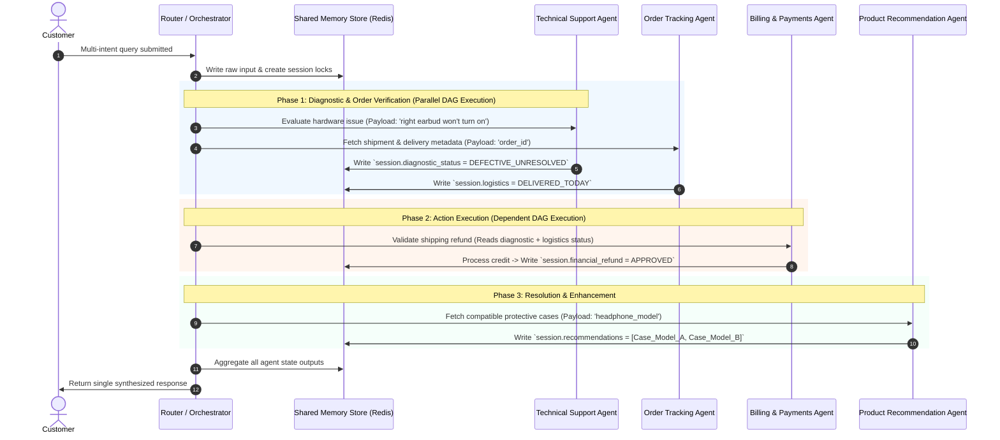

How did your choice of architectural pattern, agent roles, and communication strategy ensure that your multi-agent system maintains customer context and delivers a seamless service experience across diverse inquiry types?

Here is the complete multi-domain integration breakdown showing how all specialized roles operate under the central architecture to deliver a seamless customer experience.

---

### **1. Domain Contributions to End-to-End Customer Experience**

Each specialized agent covers a distinct boundary in the e-commerce lifecycle while storing data back to the central state store:

* **Product Recommendation Agent:**
* **Role:** Analyzes user purchase history, active cart state, browsing logs, and explicit preferences to generate tailored product options, accessory pairings, or replacements.

* **Write Scope:** Restricted to `session.recommendations_*` and `session.cart_suggestions_*`.
* **Experience Contribution:** Eliminates generic choices by providing immediate context-aware solutions (e.g., suggesting a compatible charger when a customer inquires about a device).

* **Order Tracking Agent:**
* **Role:** Interfaces directly with warehouse APIs, inventory management, and shipping carrier systems to deliver real-time shipment progress, delivery windows, and location updates.

* **Write Scope:** Restricted to `session.logistics_*` and `session.tracking_status_*`.
* **Experience Contribution:** Replaces vague delivery estimates with live tracking updates and proactive delays management without requiring customers to look up tracking numbers manually.

* **Technical Support Agent:**
* **Role:** Accesses diagnostic trees, hardware/software technical manuals, and setup documentation to troubleshoot product issues or guide initial setup.

* **Write Scope:** Restricted to `session.support_ticket_*` and `session.diagnostic_status_*`.
* **Experience Contribution:** Solves complex post-purchase functional issues step-by-step without sending the customer to generic FAQ pages.

* **Billing & Payments Agent:**
* **Role:** Manages secure financial operations, invoice verification, payment method updates, store credits, and refund authorizations in compliance with payment policies.

* **Write Scope:** Restricted to `session.financial_*` and `session.refund_status_*`.
* **Experience Contribution:** Provides quick, secure financial resolutions directly within the chat window, eliminating cumbersome manual support ticket queues.

---

### **2. End-to-End Multi-Agent Lifecycle Scenario**

To illustrate how all four specialist agents interact simultaneously without domain conflict or context loss, consider a comprehensive customer query:

> **Customer Query:** *"I received my wireless headphone order today, but the right earbud won't turn on. If it's broken, I want a refund on shipping, a replacement sent, and a recommendation for a protective carrying case so this doesn't happen again."*

#### **Execution Sequence:**

1. **Intent Parsing & Sub-task DAG Generation:** The Router analyzes the query and breaks it down into four sub-intents: `Tech_Troubleshoot`, `Verify_Delivery`, `Process_Refund`, and `Suggest_Accessories`.
2. **Parallel Phase 1 (Diagnostics & Verification):**
* **Technical Support Agent** runs a rapid diagnostic check to confirm if the issue requires replacement or a quick hard reset.
* **Order Tracking Agent** verifies delivery confirmation timestamps via carrier integration to validate eligibility.
* Both agents record their findings into their respective isolated memory namespaces (`session.diagnostic_status` and `session.logistics`).

3. **Sequential Phase 2 (Financial Execution):**
* The Router detects that Phase 1 is complete. Because `session.diagnostic_status` shows `DEFECTIVE_UNRESOLVED` and `session.logistics` shows `DELIVERED_TODAY`, the Router invokes the **Billing & Payments Agent** with verified proof.

* The Billing Agent executes the shipping refund transaction and locks `session.financial_refund`.

4. **Parallel Phase 3 (Recommendation Enhancement):**
* Concurrently, the Router dispatches the product model details to the **Product Recommendation Agent**, which retrieves compatible protective hard cases matching the exact model purchased.

5. **Synthesis & Final Response:** The Router aggregates all four execution outputs from the shared memory store and returns a single, clear response to the user:

> *"I'm sorry to hear your right earbud isn't powering on! Since troubleshooting indicates a hardware defect on delivery, I have automatically initiated a free replacement order and credited the original shipping fee back to your account. Additionally, to help keep your replacement safe on the go, here are two top-rated protective hard cases designed specifically for your model."*

---

### **3. Multi-Domain Matrix**

| Specialized Agent | Input Payload Keys | Primary System Integrations | Output Memory Keys | Customer Value Delivered |
| --- | --- | --- | --- | --- |
| **Product Recommendation**  | `user_id`, `item_id`, `cart_context` | Product Catalog, Vector Embeddings ML Engine | `session.recommendations_*` | Personalized upsell/cross-sell without manual searching.

 |
| **Order Tracking**  | `order_id`, `tracking_num` | WMS (Warehouse System), FedEx/UPS APIs | `session.logistics_*` | Instant real-time order visibility without external tracking links.

 |
| **Technical Support**  | `device_model`, `error_codes` | Technical KB, Diagnostic Workflows | `session.support_ticket_*` | Immediate step-by-step resolution of functional issues.

 |
| **Billing & Payments**  | `transaction_id`, `amount`, `reason` | Stripe/PayPal Gateway, ERP Ledger | `session.financial_*` | Automated, secure financial adjustments and refunds.

 |
