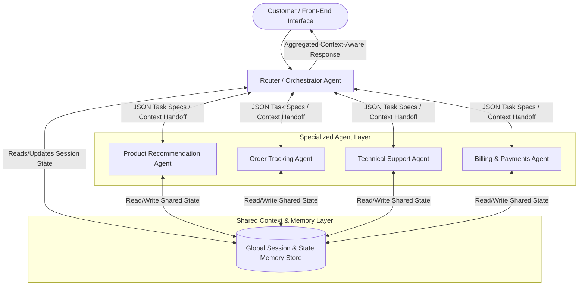

Here is an refined, comprehensive multi-agent system design based on your scenario specifications:

---

### **1. Architectural Pattern Choice & Justification**

* **Selected Pattern:** **Centralized (Hub-and-Spoke / Orchestrator)**

* **Justification:** In a customer service setting with multi-domain requests, a centralized Orchestrator/Router serves as the single entry and aggregation point.

* **Alignment with Requirements:** Customers frequently present overlapping or compound issues (e.g., a technical query linked to a recent purchase and billing issue). A centralized pattern ensures strict session control, prevents endless inter-agent routing loops, maintains context, and returns a unified voice to the user.

---

### **2. Agent Roles and Specializations**

* **Router / Orchestrator Agent:** Analyzes incoming customer intent, breaks down complex requests into sub-tasks, dispatches tasks to specialist agents, aggregates findings, and synthesizes the final customer-facing response.

* **Product Recommendation Agent:** Specializes in personalized product suggestions, cross-selling, upselling, and inventory searches based on user preferences and browsing/purchase history.

* **Order Tracking Agent:** Interacts with supply chain and logistics services to check real-time order statuses, delivery timelines, carrier updates, and address changes.

* **Technical Support Agent:** Handles product usage guides, troubleshooting workflows, compatibility inquiries, and diagnostic steps using technical documentation bases.

* **Billing & Payments Agent:** Manages payment processing details, invoices, refunds, price adjustments, and subscription changes in accordance with security standards.

**Handling Overlaps & Cross-Domain Requests:**

When an issue crosses boundaries (e.g., *"My order arrived damaged, so I want a replacement and a partial refund"*), the **Router Agent** divides the prompt into distinct domain sub-tasks. It concurrently calls the **Technical Support Agent** (for replacement procedures) and the **Billing & Payments Agent** (for refund validation). The Router then synthesizes both results into a single cohesive message, eliminating department-hopping.

---

### **3. Communication Flows & Protocols**

* **Data Format:** Standardized **JSON Payloads** specifying `session_id`, `user_id`, `task_type`, `context_snapshot`, and `payload_data`.
* **Communication Protocol:** Asynchronous Event-Driven Messaging over a message queue (e.g., RabbitMQ/Kafka) or direct gRPC calls for low-latency task execution.
* **Context Maintenance:** Specialist agents do not interact directly with the end customer; all requests flow through the Router to ensure consistent execution schemas and unified response formatting.

---

### **4. Memory and Context Management Strategy**

* **Shared State Memory Store:** A centralized key-value database (e.g., Redis) stores real-time interaction logs, sub-agent outputs, active variables, and customer context indexable by `session_id`.

* **Partial Solution Integration:** As individual agents execute tasks, they append structured JSON results to the shared session state. Subsequent sub-tasks read these output states directly, allowing dependent processing without requesting duplicate information from the user.

* **Safeguards Against Information Loss:**
* **Pre-Execution Checkpointing:** Conversation history and state snapshots are committed to persistent memory before delegating any sub-task.
* **Fallback & Retry Logic:** If an agent call fails or times out, the Router retries with cached context or seamlessly triggers a fallback action without losing previous turn data.

---

### **5. Customer Experience Improvements**

* **Zero Context Loss:** Customers state their problem once; all relevant historical and session data persists across sub-tasks.

* **Single Unified Interface:** Eliminates frustrating department transfers by communicating through a single orchestrator.

* **Parallel Processing:** Handles multi-part inquiries simultaneously in the background, significantly reducing overall response times.
