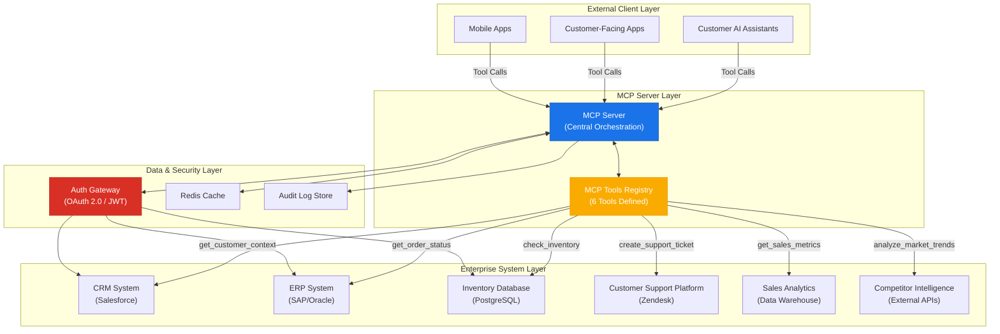
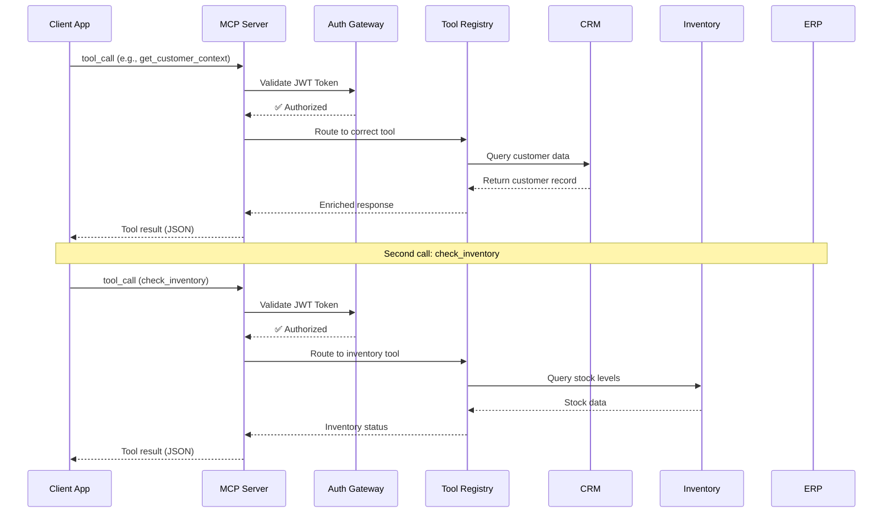

# MCP Enterprise Integration Architecture Diagram

## System Overview

This diagram illustrates the Model Context Protocol (MCP) integration architecture for the Fortune 500 retail enterprise, showing how the centralized MCP server orchestrates interactions between AI-powered services and existing enterprise systems.

## Request Flow Diagram

## Integration Points Summary

| System | Protocol | Data Exposed via MCP | Latency Target |
|--------|----------|---------------------|----------------|
| CRM (Salesforce) | REST API | Customer profiles, purchase history, preferences | < 200ms |
| ERP (SAP/Oracle) | OData/REST | Order status, shipment tracking, invoices | < 300ms |
| Inventory DB | PostgreSQL + API | Stock levels, SKU details, warehouse locations | < 100ms |
| Customer Support | REST API | Ticket history, satisfaction scores, escalation status | < 200ms |
| Sales Analytics | SQL/BI API | Revenue metrics, product performance, trends | < 500ms |
| Competitor Intel | External APIs | Market pricing, competitor catalog data | < 1000ms |

## Key Architectural Decisions

1. **Single MCP Server**: Centralized orchestration simplifies tool management and security policy enforcement.
2. **Tool Registry Pattern**: Each enterprise system is abstracted behind a tool interface — clients never call systems directly.
3. **Auth Gateway**: All requests pass through OAuth 2.0/JWT validation before reaching any enterprise system.
4. **Redis Cache**: Reduces latency for frequently accessed data (customer profiles, inventory snapshots).
5. **Audit Logging**: Every tool call is logged for compliance and debugging.
